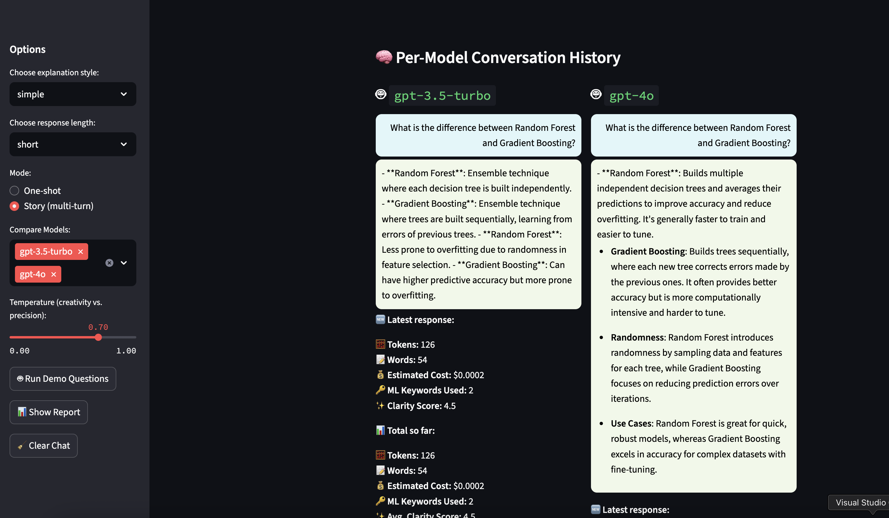

# 🤖 GPT Model Comparison (ML Model Explainer)

A Streamlit-based interactive chatbot that helps you understand machine learning concepts—powered by OpenAI's GPT models
and enriched with clarity metrics, cost analysis, and per-model comparisons.

---

## 🔧 Features

* 🧠 **Explain ML concepts interactively**
* 🔄 **Compare multiple models**: GPT-3.5, GPT-4, GPT-4o — side-by-side
* 💬 **Conversation Modes**: One-shot or multi-turn *Story* mode
* 🎛️ **Adjustable tone and length**: Simple, technical, or analogy-based explanations
* 🌡️ **Temperature control**: Tune between creativity and precision
* 🧾 **Per-model history & clarity metrics**: Understand how clearly each model responds
* 📊 **Usage report**: View token usage, cost, clarity, and keyword density
* 🤖 **Run demo questions**: Auto-run to see model behavior in action
* 💾 **Save report**: Export all model results as a CSV
* 🧹 **Reset chat or toggle reports**: Quickly start fresh or dive into metrics

---

## 🚀 Setup

```bash
git clone https://github.com/iFimich/GPT-Model-Comparison.git
cd ml-model-explainer
python -m venv venv
source venv/bin/activate  # On Windows: .venv\Scripts\activate
pip install -r requirements.txt
```

Create a `.env` file in the root folder with your OpenAI API key:

```env
OPENAI_API_KEY=your-api-key-here
```

Then launch the app:

```bash
streamlit run app/streamlit_app.py
```

---

## 📝 Usage

Once the app is running:

1. Choose your **explanation style**, **length**, and **conversation mode**
2. Select one or more **GPT models** to compare
3. Ask a question, or try the **predefined demo questions**
4. View model responses with per-model **chat history**, **clarity**, and **keywords**
5. Click **📊 Show Report** for detailed **token usage** and **cost metrics**

---

### 🖥️ Demo Screenshot



## 📬 Feedback or Contributions

Feel free to open issues or submit PRs. Ideas to improve the tool or make it more insightful are always welcome!
